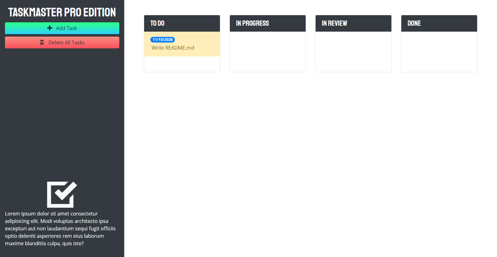

# Taskmaster Pro
## Purpose
Taskmaster Pro is a task management application with visual reminders for when a user approaches a task's due date or when the task is past due.

## Contents
1. [Features](#features)
2. [Web Page](#web-page)
3. [Contribution](#contribution)

## Features
* Users can add new tasks and set a future due date using the "Add Task" button.
* Users can drag-and-drop tasks to update them as "in progress," "in review," or "done".
* Tasks will appear with a yellow background as they approach two days before the set due date.
* Tasks that are past due will appear with a red background.
* Tasks can be removed individually by drag-and-drop to a trash drop zone at the bottom of the page.
* All tasks can be deleted at once with the "Delete All Tasks" button.
* Web page is media query responsive.

## Web Page

[Deployed Web Page](https://deckiedevs.github.io/taskmaster-pro)

## Contribution
Created with excitement by Mila Decker.